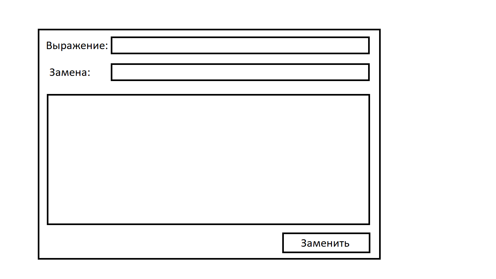

# Регулярные выражения 1

## 1. Составление выражений

Составьте выражения для:
- поиска текста "текст";
- поиска слов из 3 букв, начинающихся на 'к', заканчивающихся на 'т' ("кот", "кит", но не "кт", "коот", "к1т");
- поиска номера телефона в формате +7(###)####-##-##;
- поиска email (обязательна собака '@' и домен верхнего уровня, вроде '.ru' или '.com', до и после собаки размещаются корректные символы);
- корретного имени переменной в языке C#;
- поиска слов, содержащих только буквы;
- поиска наборов символов, которые содержат и буквы и цифры ('абвгд' не подходит, '123' не подходит, 'ыва12ф' подходит). Используйте "или" (символ |);
Дополнительно:
- поиска изображений (``), находящихся внутри тега `
`

## 2. Программа для замены символов

Составьте программу для замены текста по регулярному выражению:

В поле "выражение" вводится регулярное выражение. 

В поле "замена" вводится текст, на который нужно поменять найденные подстроки.

В большом многострочном поле ввода пишется текст, который нужно обрабатывать.

По нажатию на кнопку "Заменить" происходит замена найденных с помощью регулярного выражения фрагментов на значение, написанное в поле "Замена".

Используйте класс `RegEx` и его статические методы (вроде `Replace`, `IsMatch`, `Matches` и т.д.)

